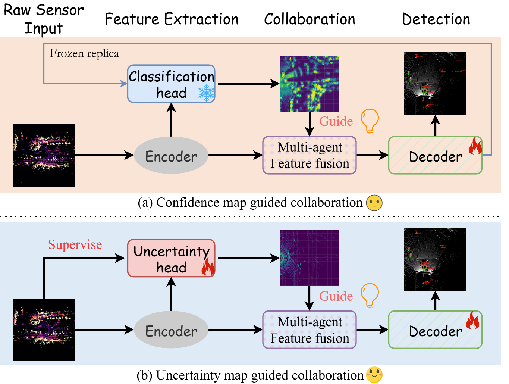
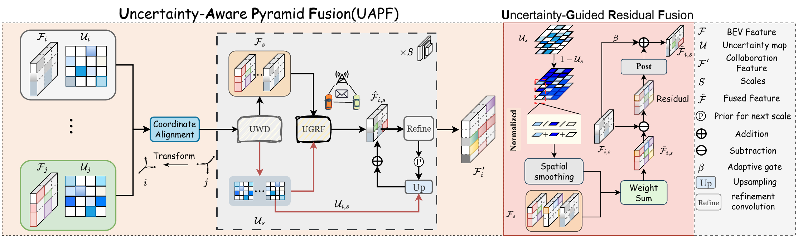

<div align="center">

# UECP: Uncertainty-Enhanced Collaborative Perception

<p><b>ECCV 2026</b></p>

<p>
  <a href="https://arxiv.org/abs/2606.23046"></a>
  <a href="#quick-start"></a>
  <a href="CITATION.cff"></a>
  <a href="LICENSE"></a>
</p>

<p>
  <a href="https://arxiv.org/abs/2606.23046"><b>Paper</b></a> |
  <a href="#what-is-uecp"><b>Overview</b></a> |
  <a href="#installation"><b>Installation</b></a> |
  <a href="#data-preparation"><b>Data</b></a> |
  <a href="#quick-start"><b>Quick Start</b></a> |
  <a href="#citation"><b>Citation</b></a>
</p>

<p>Kang Yang · Tianci Bu · Peng Wang · Deying Li · Wen Jie · Yongcai Wang</p>

<p>
  
</p>

</div>

## What Is UECP?

Collaborative perception lets multiple vehicles or roadside units share what they see, so that one
agent can detect objects that are far away, partially blocked, or hard to observe alone. In this
repository, each agent observes the world with LiDAR, a sensor that measures 3D points around the
vehicle.

**UECP** adds a simple idea to this process: each agent should also estimate **how reliable each
area of its LiDAR observation is**. Areas with many LiDAR points are usually more reliable; areas
with few points are more uncertain. UECP learns this reliability map and uses it to guide feature
fusion, so the final detector can trust strong observations and seek help from neighboring agents
when local evidence is weak.

The reliability map is represented in BEV, short for bird's-eye view: a top-down grid of the road
scene.

The paper has been accepted by **ECCV 2026** and is available as
[arXiv:2606.23046](https://arxiv.org/abs/2606.23046).

## Highlights

| Component | Plain-language meaning |
|:--|:--|
| **Uncertainty map** | A top-down map showing which regions are reliable or uncertain based on LiDAR point density. |
| **UAPF** | A fusion module that uses uncertainty maps to combine multi-agent BEV features. |
| **LiDAR experiments** | Runnable training and evaluation configs for DAIR-V2X-C and V2V4Real. |
| **OpenCOOD lineage** | Built on the HEAL/OpenCOOD collaborative perception codebase. |

## Method

<p align="center">
  
  <br>
  <sub><b>UECP/UAPF.</b> The model predicts uncertainty maps and uses them to guide collaborative feature fusion.</sub>
</p>

In this release, the ground-truth uncertainty map is generated from LiDAR point density:

```text
uncertainty = 1 - normalized_point_density
```

Dense cells are treated as more reliable. Sparse cells are treated as more uncertain. During
training, a small uncertainty head learns to predict this map from BEV features. During fusion, UAPF
uses the predicted map to decide how much each agent should contribute at each BEV location.

## What Is Included

This repository contains the core runnable code for UECP:

| Purpose | Path |
|:--|:--|
| DAIR-V2X-C config | `opencood/hypes_yaml/dairv2x/LiDARonly_baseline/UAPF.yaml` |
| V2V4Real config | `opencood/hypes_yaml/v2v4real/LiDAR_only/UAPF.yaml` |
| Training | `opencood/tools/train.py` |
| Evaluation | `opencood/tools/inference.py` |
| UECP model | `opencood/models/bev_text_v1.py` |
| UAPF fusion module | `opencood/models/utils/pyramid_fusion_modulev1.py` |
| Uncertainty-map generation | `opencood/utils/create_gt_uncertainty*.py` |

Datasets, checkpoints, and large generated results are not distributed in this repository.

## Installation

Create a Python environment first:

```bash
conda create -n uecp python=3.8
conda activate uecp
```

Install PyTorch for your CUDA version. For CUDA 11.8, one common command is:

```bash
pip install torch --index-url https://download.pytorch.org/whl/cu118
```

Then install the remaining dependencies:

```bash
pip install -r requirements.txt
pip install spconv-cu118
python setup.py develop
python opencood/utils/setup.py build_ext --inplace
```

Use the `spconv-cuXXX` package that matches your CUDA version.

## Data Preparation

Put datasets under `dataset/`:

```text
dataset/
├── DAIR-V2X-C/
│   ├── train.json
│   ├── val.json
│   ├── cooperative/
│   ├── infrastructure-side/
│   └── vehicle-side/
└── V2V4REAL/
    ├── train/
    ├── validate/
    └── test/
```

Generate uncertainty maps before training:

```bash
python opencood/utils/create_gt_uncertainty.py \
  --data-root dataset/DAIR-V2X-C

python opencood/utils/create_gt_uncertainty_v2v4real.py \
  --data-root dataset/V2V4REAL
```

For DAIR-V2X-C, the generated files are saved under `gt_uncertainty_maps/` beside each `velodyne/`
directory. For V2V4Real, the generated `.npy` files are saved beside the corresponding `.pcd` files.

## Quick Start

Train UECP on DAIR-V2X-C:

```bash
python opencood/tools/train.py \
  -y opencood/hypes_yaml/dairv2x/LiDARonly_baseline/UAPF.yaml
```

Train UECP on V2V4Real:

```bash
python opencood/tools/train.py \
  -y opencood/hypes_yaml/v2v4real/LiDAR_only/UAPF.yaml
```

Evaluate a trained run:

```bash
python opencood/tools/inference.py \
  --model_dir opencood/logs/<run_name> \
  --fusion_method intermediate
```

The evaluation result is written to:

```text
opencood/logs/<run_name>/eval_intermediate_epoch<epoch>.yaml
```

## Repository Layout

```text
assets/                         # Teaser and method figures
opencood/hypes_yaml/            # Runnable experiment configs
opencood/models/bev_text_v1.py  # UECP model
opencood/models/utils/          # UAPF fusion module
opencood/tools/                 # Training and evaluation scripts
opencood/utils/create_gt_*.py   # Uncertainty-map generation scripts
```

## Citation

If UECP is useful for your research, please cite:

```bibtex
@inproceedings{yang2026uecp,
  title={UECP: Uncertainty-Enhanced Collaborative Perception},
  author={Yang, Kang and Bu, Tianci and Wang, Peng and Li, Deying and Jie, Wen and Wang, Yongcai},
  booktitle={European Conference on Computer Vision (ECCV)},
  year={2026},
  eprint={2606.23046},
  archivePrefix={arXiv},
  primaryClass={cs.CV},
  url={https://arxiv.org/abs/2606.23046}
}
```

This implementation builds on HEAL/OpenCOOD. Please also cite the upstream works when using this
codebase:

```bibtex
@inproceedings{
lu2024an,
title={An Extensible Framework for Open Heterogeneous Collaborative Perception},
author={Lu, Yifan and Hu, Yue and Zhong, Yiqi and Wang, Dequan and Chen, Siheng and Wang, Yanfeng},
booktitle={The Twelfth International Conference on Learning Representations},
year={2024},
}
```

```bibtex
@inproceedings{xu2022opencood,
  author = {Runsheng Xu, Hao Xiang, Xin Xia, Xu Han, Jinlong Li, Jiaqi Ma},
  title = {OPV2V: An Open Benchmark Dataset and Fusion Pipeline for Perception with Vehicle-to-Vehicle Communication},
  booktitle = {2022 IEEE International Conference on Robotics and Automation (ICRA)},
  year = {2022}}
```

## Acknowledgements

This repository is derived from the HEAL/OpenCOOD research codebase. We thank the authors and
maintainers of [HEAL](https://github.com/yifanlu0227/HEAL) and
[OpenCOOD](https://github.com/DerrickXuNu/OpenCOOD) for their open-source contributions to
collaborative perception research.

## License

This release keeps the inherited academic software license in `LICENSE`. Please review the license
terms before redistribution or commercial use.
